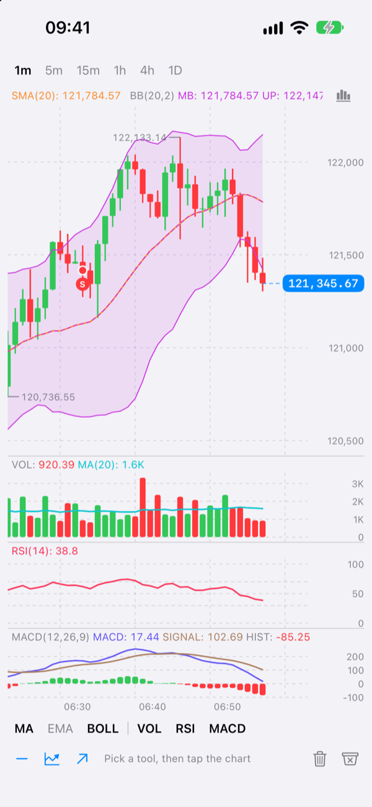
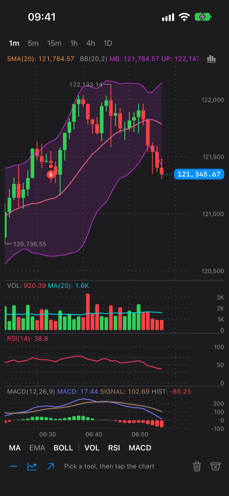
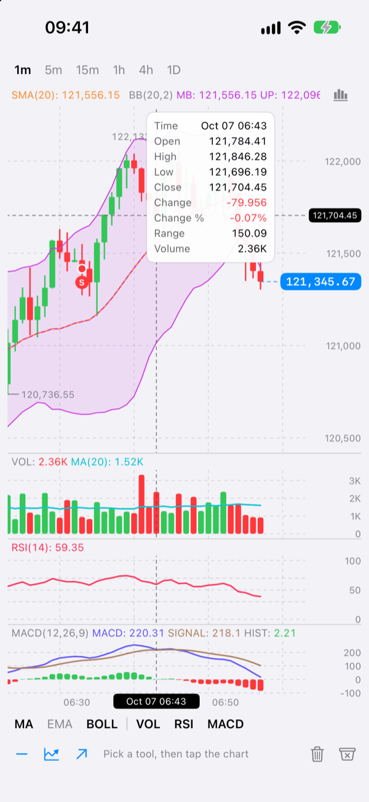
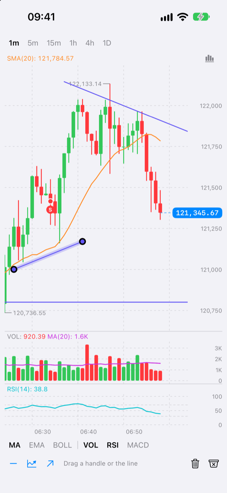
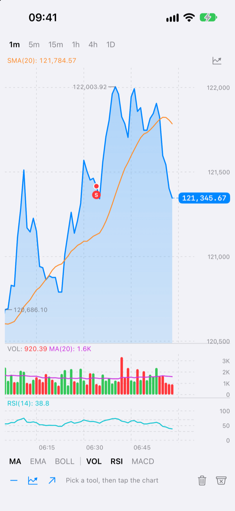
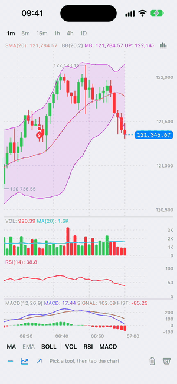

# TradingChart

A native SwiftUI trading chart for iOS: candlesticks, lines and areas with technical indicators, a crosshair, pinch zoom, drawing tools and paged history, built on Swift Charts.

[](https://www.swift.org)
[-007AFF.svg?logo=apple&logoColor=white)](https://developer.apple.com/ios/)
[](https://swift.org/package-manager/)
[](LICENSE)
[](https://github.com/pavellunev/trading_chart/actions/workflows/ci.yml)

<table>
  <tr>
    <td align="center"></td>
    <td align="center"></td>
    <td align="center"></td>
  </tr>
  <tr>
    <td align="center"><sub>Candles, overlays and panes</sub></td>
    <td align="center"><sub>Dark appearance</sub></td>
    <td align="center"><sub>Crosshair and tooltip</sub></td>
  </tr>
  <tr>
    <td align="center"></td>
    <td align="center"></td>
    <td align="center"></td>
  </tr>
  <tr>
    <td align="center"><sub>Drawing tools</sub></td>
    <td align="center"><sub>Area style (and line, candles)</sub></td>
    <td align="center"><sub>Scrolling and zooming</sub></td>
  </tr>
</table>

## Features

- **Three styles**: line, area (gradient fill) and candlesticks, switchable at runtime, with an optional style picker on the chart.
- **Technical indicators**: SMA, EMA, WMA, Bollinger Bands, Volume (with a moving average), RSI and MACD, drawn over the price or in panes of their own that scroll together with it. Write your own with a single protocol.
- **Smooth scrolling**: one-finger pan with inertia, pinch zoom, and a price axis that follows the visible bars exactly on every frame.
- **Live data**: append ticks or candles while the chart stays glued to the newest bar; an interval gate drops updates for the wrong timeframe; the current price has a dashed line and a badge on the price axis.
- **History paging**: the chart tells you when the user nears the oldest bar, you prepend an older page, and nothing jumps.
- **Crosshair**: long-press and drag to read a bar; a tooltip with open, high, low, close, change, range and volume; legends with the values of every indicator.
- **Drawing tools**: horizontal line, trend line and ray, created with taps, selected and dragged by anchor or body. Drawings are `Codable`; add your own tools with the `DrawingTool` protocol.
- **Details that traders expect**: the highest and the lowest price of the window labelled, buy and sell markers, a loading indicator while history loads, light and dark appearance, VoiceOver scrolling.
- **Themeable**: colours, fonts, strokes, price and time formatting are injected through the SwiftUI environment.
- **14 languages** (Arabic included, without mirroring the chart): VoiceOver texts, the tooltip and the style picker are translated and follow the language of your app.
- **Three small modules**: the data model and math (`TradingChartCore`) and the indicators (`TradingChartIndicators`) need only Foundation and CoreGraphics, run on iOS 16 and are unit-tested without a UI.

## Requirements

- Chart UI (`TradingChart`): iOS 17.0 or later
- `TradingChartCore` and `TradingChartIndicators`: iOS 16.0 or later
- Swift 6.0 or later (Xcode 16 or later)

The package can be added to apps targeting iOS 16: every type of the chart UI is marked `@available(iOS 17.0, *)`, so gate the chart with `if #available(iOS 17, *)` and show something else (a web chart, say) on iOS 16:

```swift
import SwiftUI
import TradingChart

struct ChartScreen: View {
    var body: some View {
        if #available(iOS 17, *) {
            NativeChart()
        } else {
            Text("The chart needs iOS 17")   // your fallback
        }
    }
}

@available(iOS 17, *)
struct NativeChart: View {
    @State private var model = TradingChartModel(style: .candles)

    var body: some View {
        TradingChartView(model: model)
    }
}
```

## Installation

### Xcode

Choose **File > Add Package Dependencies...**, enter the URL of this repository, `https://github.com/pavellunev/trading_chart`, pick **Up to Next Minor Version** from `0.1.0` and add the `TradingChart` product to your app target.

### Package.swift

```swift
dependencies: [
    .package(url: "https://github.com/pavellunev/trading_chart", .upToNextMinor(from: "0.1.1")),
],
targets: [
    .target(
        name: "MyApp",
        dependencies: [
            .product(name: "TradingChart", package: "trading_chart"),
        ]
    ),
]
```

`TradingChart` re-exports the other two modules, so `import TradingChart` gives you the whole API. If you only need the data model or the indicator math (in a non-UI target, say), depend on `TradingChartCore` or `TradingChartIndicators` instead.

## Quick start

A chart is a `TradingChartView` that shows a `TradingChartModel`. The model owns the data, the scroll position and the overlays; you feed it a `ChartSeries`.

### A line chart from `[PricePoint]`

```swift
import SwiftUI
import TradingChart

struct PriceChart: View {
    @State private var model = TradingChartModel(style: .line)

    var body: some View {
        TradingChartView(model: model)
            .frame(height: 320)
            .task {
                let points: [PricePoint] = await loadPoints()   // your data source
                model.setSeries(ChartSeries(points: points, interval: .minutes(5)))
                model.currentPrice = points.last?.value
            }
    }
}
```

### Candles from `[Candle]`

```swift
import SwiftUI
import TradingChart

struct CandleChart: View {
    @State private var model = TradingChartModel(style: .candles)

    var body: some View {
        TradingChartView(model: model)
            .frame(height: 420)
            .task {
                let candles: [Candle] = await loadCandles()   // your data source
                model.setSeries(ChartSeries(candles: candles, interval: .minutes(15)))
                model.currentPrice = candles.last?.close
            }
    }
}
```

The `time` of a candle (or a point) is the start of its bucket, for example 12:15:00 for a 15-minute bar. A `ChartSeries` sorts its bars and keeps one bar per timestamp. `ChartInterval` has `.minutes(_:)`, `.hours(_:)`, `.days(_:)` and `.weeks(_:)`, or `ChartInterval(seconds:)` for anything else. Bars start on a fixed grid in UTC: days at midnight, and weeks on Monday (`.weeks(1, startingOn: .sunday)` for an exchange that starts its week on another day). A live tick falls into the bucket of that grid, so the grid has to be the one the candles of your data source are on. Without an `origin` (`ChartInterval(seconds: 604_800)`) a week starts on a Thursday, the weekday of the Unix epoch.

Bad data does not reach the chart. A candle or a point whose time or price is not finite (`nan`, `inf`, a `Decimal.nan`) is dropped, a candle whose `high` is below its `low` (or below its open or close) is repaired, and an update with such values is ignored (`update` returns `.ignored`).

The chart takes the width and the height you give it; the panes of indicators are carved out of that height, and the price pane gets the rest.

## Live updates

`setSeries(_:scroll:)` replaces everything: use it for the first load, a new symbol or a new interval. `update(...)` changes the newest bar or appends one:

```swift
import Foundation
import TradingChart

@MainActor
func receive(price: Double, at time: Date, size: Double, into model: TradingChartModel) {
    // A trade: it goes into the bar its time falls into, or starts a new bar.
    model.update(price: price, at: time, volume: size)
    model.currentPrice = price   // the dashed line and the badge
}

@MainActor
func receive(candle: Candle, builtFor interval: ChartInterval, into model: TradingChartModel) {
    // A candle from a stream. It replaces the last bar, appends a newer one and drops an older one.
    // `interval` is the gate: an update built for another timeframe (a late message that arrives after
    // the user switched to a different interval) is ignored instead of corrupting the series.
    model.update(candle, interval: interval)
}
```

Points of a line series have the same gate: `update(_ point: PricePoint, interval:)`.

A model starts with `ChartSeries.empty(interval: .minutes(1))`: an empty series of candles, so the first tick opens a candle and a page of candles can be prepended afterwards. A tick, and a `PricePoint` that is applied as one (`update(_ point:)` on a series of candles), opens a candle. For a line chart that never has candles, use `ChartSeries.empty(interval: interval, kind: .points)`. Once a series has bars it keeps its kind, and a page of history of the other kind is converted to it rather than dropped: `prependHistory(_:)` turns candles into points at their close, and points into flat candles (each point moves to the start of its bucket, and the points of one bucket make one candle). A line chart that started from the default empty series and got a few ticks is a series of candles, so it takes a page of points as flat candles; use `kind: .points` to keep it a series of points.

How the window behaves:

- **At the live edge** (the newest bar at the right edge, within a small tolerance) the window follows: a tick or a new bar keeps the newest bar where it is. `model.isAtLiveEdge` tells where the window is, and `TradingChartEvent.liveEdgeChanged` reports it when it changes.
- **Away from it** (the user scrolled into the history) the window does not move, and the price badge turns into a button with a chevron that calls `model.scrollToLiveEdge()`.
- **`setSeries`** keeps this logic by default (`scroll: .automatic`): the window jumps to the live edge when the interval changed or it was at the live edge before. Use `.liveEdge` or `.preserve` to say otherwise.
- **The scroll anchor and the data change in one mutation**, so the chart never draws a frame with new data and the old window.
- **`configuration.maxLiveBarCount`** (600 by default) caps the series while it grows at the live edge. A live update never trims the bars the user is looking at, or has just scrolled past.

Trade markers are plain data: `model.markers = [ChartMarker(id: "b1", time: time, kind: .buy)]` draws a **B** (or an **S** for `.sell`) at the price of the series at that time, or at `price:` if you give one.

## Events

The model reports what happens through `onEvent`: the window reaching the oldest bar, the crosshair moving, a drawing added, changed or removed, the window leaving the live edge. **There is one handler**: assigning `onEvent` again replaces the previous one, so handle every event you need in a single `switch`. (Two snippets that each assign `onEvent` would cancel each other, and the paging would stop.)

```swift
import Foundation
import TradingChart

@MainActor func loadOlderHistory(into model: TradingChartModel) { /* see History paging */ }
@MainActor func saveDrawings(of model: TradingChartModel) { /* see Saving drawings */ }

@MainActor
func observe(_ model: TradingChartModel) {
    model.onEvent = { [weak model] event in
        guard let model else { return }
        switch event {
        case .approachedHistoryStart:
            loadOlderHistory(into: model)
        case .drawing(.added), .drawing(.changed), .drawing(.removed):
            saveDrawings(of: model)
        case .drawing:
            break   // the selection changed
        case .crosshairChanged(let state):
            print(state?.time as Any, state?.value as Any)   // state.candle, state.indicatorValues, ...
        case .liveEdgeChanged(let isAtLiveEdge):
            print("at the live edge:", isAtLiveEdge)
        }
    }
}
```

The handler runs on the main actor. A second part of your app that needs the events (a toolbar that follows the selection, say) is called from this handler; the model does not have several subscribers in this version.

## Customization

### Theme and formatters

`TradingChartTheme` holds colours, fonts and strokes; `PriceFormatter` and `TimeFormatter` turn numbers and dates into text. All three are set through the SwiftUI environment, so they apply to everything below the view you attach them to.

```swift
import SwiftUI
import TradingChart

struct ThemedChart: View {
    let model: TradingChartModel

    private var theme: TradingChartTheme {
        var theme = TradingChartTheme.standard   // adapts to light and dark appearance
        theme.bullish = Color(red: 0.03, green: 0.78, blue: 0.51)
        theme.bearish = Color(red: 0.96, green: 0.27, blue: 0.36)
        theme.lineInterpolation = .catmullRom
        theme.indicatorPalette = [.orange, .purple, .teal]
        return theme
    }

    var body: some View {
        TradingChartView(model: model)
            .tradingChartTheme(theme)
            .tradingChartPriceFormatter(PriceFormatter { value, context in
                switch context {
                case .compact: value.formatted(.number.notation(.compactName))   // volumes, indicator panes
                default: value.formatted(.currency(code: "USD"))
                }
            })
            .tradingChartTimeFormatter(TimeFormatter { date, _, context in
                context == .crosshair
                    ? date.formatted(date: .abbreviated, time: .shortened)
                    : date.formatted(date: .omitted, time: .shortened)
            })
    }
}
```

`PriceFormatter.automatic` (the default) picks the number of decimals from the magnitude of the price, and `PriceFormatter.fractionDigits(_:)` fixes it. A formatter learns where its text goes (`.axis`, `.badge`, `.crosshair`, `.legend` or `.compact`), so it can show fewer digits on the axis than in the badge.

### Configuration

`TradingChartConfiguration` switches features and sets the geometry. Pass it to the model, or change `model.configuration` later.

```swift
import TradingChart

@MainActor
func makeModel() -> TradingChartModel {
    var configuration = TradingChartConfiguration()
    configuration.maxLiveBarCount = 1_000             // bars kept while the live edge grows
    configuration.paneHeight = 80                     // height of every indicator pane
    configuration.showsHighLowMarkers = false         // the labels of the window's high and low
    configuration.isDrawingEnabled = false            // no drawing tools
    configuration.viewport.candleVisibleBars = 50     // bars across the window for candles
    configuration.stylePicker = StylePickerOptions(   // the style menu on the chart
        availableStyles: [.area, .candles],
        titles: [.area: "Line"]                       // optional: replaces the translated title of a style
    )
    return TradingChartModel(style: .candles, configuration: configuration)
}
```

Other switches: `showsCurrentPriceLine`, `showsPriceBadge`, `showsLegend`, `isCrosshairEnabled`, `isZoomEnabled`, `isHapticsEnabled`. `ViewportConfiguration` sets the default, minimum and maximum number of bars across the window and the gap at the live edge.

`SeriesStylePicker` is the same control as a public view, if you want it in a toolbar.

## Localization

The chart speaks 14 languages out of the box: English, German, Spanish, French, Hindi, Indonesian, Italian, Dutch, Brazilian Portuguese, Russian, Turkish, Vietnamese, Simplified Chinese and Arabic. The translations are resources of the package and cover everything the chart says by itself: what VoiceOver reads and offers, the "Scroll to latest" badge, the "Loading history" spinner, the rows of the crosshair tooltip and the entries of the style picker. The short names of indicators (`MA`, `EMA`, `BOLL`, `VOL`, `RSI`, `MACD`) are not translated, as on the exchanges.

**Which language.** Without any setup the chart speaks the language of your app: the language its main bundle is localized to that best matches the preferences of the user, which is the language the rest of your screens are in. An app that is only in English shows English on a device set to Arabic, and so does the chart. An app in a language the package does not have gets English; an app that declares no language at all follows the preferred languages of the device. To speak a language your app does not list in its localizations, pass it as described next.

**A language of the app's own.** An app with a language setting that may differ from its localizations or from the language of the device passes it with the `tradingChartStrings(_:)` modifier. `TradingChartStrings.localized(for:)` takes a locale; a region, a script or an underscore does not matter (`pt_BR`, `zh-Hans-CN`, `ar_SA`), and a language the package does not have gets English.

```swift
import SwiftUI
import TradingChart

struct InAppLanguageChart: View {
    let model: TradingChartModel
    let appLocale: Locale   // the language the user picked in your app

    var body: some View {
        TradingChartView(model: model)
            .tradingChartStrings(.localized(for: appLocale))
    }
}
```

**Your own words.** `TradingChartStrings` is a struct of plain `String`s: start from a language and change what you need. A string with `%@` is a format (the last price, the two ends of the visible range): keep the placeholders, and reorder them with `%1$@` and `%2$@` when your language needs another order.

```swift
import SwiftUI
import TradingChart

struct CustomWordsChart: View {
    let model: TradingChartModel
    let appLocale: Locale

    var body: some View {
        TradingChartView(model: model)
            .tradingChartStrings(strings)
    }

    private var strings: TradingChartStrings {
        var strings = TradingChartStrings.localized(for: appLocale)
        strings.volume = String(localized: "chart.volume")
        strings.showingRange = String(localized: "chart.showingRange")   // "Showing %1$@ to %2$@"
        return strings
    }
}
```

The titles of the style picker are in the strings too (`lineStyle`, `areaStyle`, `candlesStyle`, `chartStyle`); `StylePickerOptions.titles` and `accessibilityLabel` replace them for one picker.

**Right-to-left.** The chart itself is never mirrored: time runs from left to right and the price scale stays at the right in Arabic as in every other language, as on the exchanges. In a right-to-left app only the words of the crosshair tooltip are laid out as the language reads (labels at the right).

**Dates and numbers.** The time axis and the prices follow the locale of the device (`TimeFormatter.automatic`, `PriceFormatter.automatic`). To format them for another locale, give the chart your own formatters; see [Theme and formatters](#theme-and-formatters).

## Indicators

Set `model.indicators` to what you want to see:

```swift
import TradingChart

@MainActor
func showIndicators(on model: TradingChartModel) {
    model.indicators = [
        SMA(period: 20),
        EMA(period: 50),
        BollingerBands(period: 20, multiplier: 2),
        Volume(movingAveragePeriod: 20),
        RSI(period: 14),
        MACD(fast: 12, slow: 26, signal: 9),
    ]
}
```

| Indicator | Where | Notes |
| --- | --- | --- |
| `SMA`, `EMA`, `WMA` | overlay | `period`, price `source` (close, hl2, ...), line style |
| `BollingerBands` | overlay | middle line, two edges and a filled band; population standard deviation |
| `Volume` | pane | histogram tinted by the direction of the candle; an optional moving average line |
| `RSI` | pane | Wilder smoothing, fixed 0 to 100 range, overbought and oversold levels |
| `MACD` | pane | MACD and signal lines and a histogram |

**Overlay or pane.** An indicator with `placement == .overlay` is drawn on top of the price, sharing its axis, and its values take part in the autoscale. An indicator with `placement == .pane` gets a pane of its own below the price, with its own axis. The panes scroll together with the price chart, and the crosshair runs through all of them. The legends above every pane show the values at the crosshair, or at the newest bar.

Indicators are recalculated when the series changes (a tick, an append, a prepend), with the warm-up period left out: a 20-bar SMA has no value for the first 19 bars. Lines without an explicit colour take the next colours of `theme.indicatorPalette`, dealt out per indicator: all the lines of Bollinger Bands share one, and the signal line of MACD takes the next.

### Switching indicators on and off

`IndicatorBar` is a ready-made row of switches in the style of exchange apps: `MA  EMA  BOLL  |  VOL  RSI  MACD`. A tap adds or removes the indicator from `model.indicators`, in the order of the catalog.

```swift
import SwiftUI
import TradingChart

struct ChartScreen: View {
    let model: TradingChartModel

    private let catalog: [any ChartIndicator] = [
        SMA(), EMA(), BollingerBands(), Volume(movingAveragePeriod: 20), RSI(), MACD(),
    ]

    var body: some View {
        VStack(spacing: 0) {
            TradingChartView(model: model)
            IndicatorBar(model: model, catalog: catalog) {
                Button("Settings", systemImage: "gearshape") { /* your settings */ }   // optional accessory
            }
        }
    }
}
```

### A custom indicator

An indicator is a pure function from bars to something drawable. Conform to `ChartIndicator`; `IndicatorOutput` can hold lines, filled bands, histograms and horizontal levels. This one draws the Donchian channel, the highest high and the lowest low of the last `period` bars, over the price:

```swift
import SwiftUI
import TradingChart

struct DonchianChannel: ChartIndicator {
    var period = 20
    var color: ChartColor?   // nil takes the next colour of the theme's palette

    // A stable identity made of the type and its parameters: it is the cache key.
    var id: String { "donchian(\(period))" }
    var displayName: String { "Donchian \(period)" }
    var shortName: String { "DC" }   // the label in an IndicatorBar
    var placement: IndicatorPlacement { .overlay }

    func calculate(_ input: IndicatorInput) -> IndicatorOutput {
        let candles = input.candles   // oldest first
        var upper: [IndicatorValue] = []
        var lower: [IndicatorValue] = []
        var middle: [IndicatorValue] = []
        // Bars inside the warm-up period have no value: they are simply left out.
        for index in candles.indices.dropFirst(max(period, 1) - 1) {
            let window = candles[(index - max(period, 1) + 1)...index]
            let high = window.map(\.high).max() ?? candles[index].high
            let low = window.map(\.low).min() ?? candles[index].low
            let time = candles[index].time
            upper.append(IndicatorValue(time: time, value: high))
            lower.append(IndicatorValue(time: time, value: low))
            middle.append(IndicatorValue(time: time, value: (high + low) / 2))
        }
        let edge = IndicatorLineStyle(color: color, width: 1)
        return IndicatorOutput(
            lines: [
                IndicatorLine(id: "\(id).upper", name: "Upper", values: upper, style: edge),
                IndicatorLine(id: "\(id).lower", name: "Lower", values: lower, style: edge),
                IndicatorLine(
                    id: "\(id).middle",
                    name: "Middle",
                    values: middle,
                    style: IndicatorLineStyle(color: color, width: 1, dash: [4, 3])
                ),
            ],
            bands: [IndicatorBand(id: "\(id).band", upper: upper, lower: lower, fill: color)]
        )
    }
}

// model.indicators = [DonchianChannel(period: 20)]
```

For a pane, return `.pane` from `placement` and fill `histograms`, `levels` and, if the scale is fixed like that of the RSI, `fixedRange`. See the [Extending](Sources/TradingChart/TradingChart.docc/Extending.md) article for a pane example.

## Crosshair and zoom

Both are on by default. A long press on a pane shows the crosshair, and dragging moves it from bar to bar; a vertical line runs through every pane, and the tooltip shows the selected bar. A pinch zooms the window: the newest bar stays put when the window is at the live edge, and the middle of the window stays put otherwise.

```swift
import TradingChart

@MainActor
func zoomAndClear(_ model: TradingChartModel) {
    model.zoom(by: 2, anchor: .liveEdge)   // from code: bars twice as wide, half as many in the window
    model.crosshairTime = nil              // clear the crosshair from code
}
```

To react to the crosshair, handle `.crosshairChanged(let state)` in the event handler (see [Events](#events)): `state` is the bar under the crosshair (`state.candle`, `state.indicatorValues`, ...), or `nil` when it goes away.

`model.crosshair` is the bar under the crosshair, or `nil`. Turn the features off with `configuration.isCrosshairEnabled` and `configuration.isZoomEnabled`.

## Drawings

Three tools ship with the package: `.horizontalLine` (one tap), `.trendLine` and `.ray` (two taps). The package has no toolbar of its own: you decide how tools are picked, and tell the model.


### Creating drawings from your own toolbar

```swift
import SwiftUI
import TradingChart

struct DrawingToolbar: View {
    let model: TradingChartModel

    var body: some View {
        HStack(spacing: 20) {
            tool("minus", .horizontalLine)
            tool("chart.line.uptrend.xyaxis", .trendLine)
            tool("arrow.up.right", .ray)
            Button("Delete", systemImage: "trash") { model.deleteSelectedDrawing() }
                .disabled(model.selectedDrawingID == nil)
        }
        .labelStyle(.iconOnly)
    }

    private func tool(_ symbol: String, _ kind: DrawingKind) -> some View {
        let isActive = model.activeDrawingTool == kind
        return Button {
            model.activeDrawingTool = isActive ? nil : kind   // the next taps on the chart place the anchors
        } label: {
            Image(systemName: symbol)
        }
        .foregroundStyle(isActive ? Color.accentColor : Color.secondary)
    }
}
```

Once a tool is active, each tap on the chart places an anchor; the last one adds the drawing, selects it and ends the tool. A tap on a drawing selects it, and a drag that starts on a selected drawing moves its anchor or the whole drawing; any other drag scrolls the chart as usual. Anchors snap to the bars in time and are free in price. `model.removeDrawing(id:)` and `model.removeAllDrawings()` delete drawings, and `model.drawings` is the whole list.

### Saving drawings

`ChartDrawing` is `Codable` and anchored to absolute times and prices, so drawings survive scrolling, zooming and a change of interval.

```swift
import Foundation
import TradingChart

@MainActor
func restoreDrawings(into model: TradingChartModel) {
    if let data = UserDefaults.standard.data(forKey: "drawings"),
       let saved = try? JSONDecoder().decode([ChartDrawing].self, from: data) {
        model.drawings = saved
    }
}

@MainActor
func saveDrawings(of model: TradingChartModel) {
    if let data = try? JSONEncoder().encode(model.drawings) {
        UserDefaults.standard.set(data, forKey: "drawings")
    }
}
```

Call `saveDrawings` when a drawing is added, changed (at the end of a drag) or removed: from the `.drawing(.added)`, `.drawing(.changed)` and `.drawing(.removed)` cases of the event handler (see [Events](#events)).

### A custom drawing tool

A tool turns anchors into shapes in chart coordinates (time and price); the package clips them to the window, maps them to the screen, hit-tests them and moves their anchors. This rectangle needs two anchors:

```swift
import TradingChart

struct RectangleTool: DrawingTool {
    var kind: DrawingKind { "rectangle" }
    var requiredAnchorCount: Int { 2 }

    func primitives(for anchors: [ChartAnchor], in domain: ChartDomain) -> [DrawingPrimitive] {
        guard anchors.count >= 2 else { return [] }
        let first = anchors[0]
        let second = anchors[1]
        let topLeft = ChartAnchor(time: first.time, price: first.price)
        let topRight = ChartAnchor(time: second.time, price: first.price)
        let bottomRight = ChartAnchor(time: second.time, price: second.price)
        let bottomLeft = ChartAnchor(time: first.time, price: second.price)
        return [
            .segment(topLeft, topRight), .segment(topRight, bottomRight),
            .segment(bottomRight, bottomLeft), .segment(bottomLeft, topLeft),
        ]
    }
}

@MainActor
func enableRectangles(on model: TradingChartModel) {
    model.drawingTools.register(RectangleTool())
    model.activeDrawingTool = "rectangle"   // or from a button of your toolbar
}
```

A tool can also implement `hitTest(_:anchors:domain:transform:tolerance:)` to decide for itself what is under a finger (the default works on the shapes). `DrawingKind` is an open set (it is `ExpressibleByStringLiteral`, like `Notification.Name`), and it is what is saved with a drawing: register the tool again before you restore drawings of that kind.

## History paging

The chart reports when the left edge of the window gets close to the oldest bar you have loaded. You load an older page and prepend it; the window stays where it is, so nothing jumps, and the indicators are recalculated over the longer series.

```swift
import TradingChart

@MainActor
func loadOlderHistory(into model: TradingChartModel) {
    guard let oldest = model.series.firstTime else { return }
    model.isLoadingHistory = true   // shows the spinner; no second request is made meanwhile
    let interval = model.series.interval
    Task {
        let page: [Candle] = await loadCandles(before: oldest, count: 300)   // your data source
        if page.isEmpty {
            model.hasMoreHistory = false   // the source is exhausted: no more events
            model.isLoadingHistory = false
        } else {
            model.prependHistory(ChartSeries(candles: page, interval: interval))
        }
    }
}
```

Call it from the `.approachedHistoryStart` case of the event handler (see [Events](#events)).

- `.approachedHistoryStart` is sent when the window is within `configuration.historyPrefetchThreshold` of the oldest bar (one window width by default, so that even a fast fling does not reach the end before the data arrives). It is sent once per request, and not while `isLoadingHistory` is `true` or `hasMoreHistory` is `false`.
- `prependHistory(_:)` takes only the bars older than the first one, so pages that overlap are safe. A page of the other kind (points for candles, candles for points) is taken as well, converted to the kind of the series. It ends the request: it resets `isLoadingHistory`, as does `setSeries`. If a request fails, set `isLoadingHistory = false` yourself.
- While `isLoadingHistory` is `true` a live update does not trim the head of the series (`maxLiveBarCount`): a page ends at the first bar you had when you asked for it, and a bar cut off meanwhile would leave a hole between the page and the series. The next update after the request trims the surplus again.
- Set `hasMoreHistory = true` again for a new instrument.

## Limitations

This is the first version, and a few things are not there yet:

- **No monthly bars.** A month is not a fixed number of seconds, and a `ChartInterval` is. Intervals of minutes, hours, days and weeks (on any weekday) are supported.
- **One event handler.** `onEvent` holds a single closure (see [Events](#events)); the model does not have several subscribers.
- **iOS 17 for the chart.** The chart UI needs iOS 17; `TradingChartCore` and `TradingChartIndicators` run on iOS 16.
- **Scroll views around the chart.** A chart inside a vertical scroll view (a SwiftUI `ScrollView`, a `List`) shares the finger with the page: a drag that is mostly horizontal scrolls the chart, a vertical one scrolls the page, and the page stays still during the crosshair, a pinch and the drag of a drawing. A scroll view that cannot scroll vertically (a horizontal pager, a `ScrollView` with `.scrollDisabled(true)`) leaves the chart to take a drag in any direction. The pan of every scroll view above the chart waits for the chart's, so a horizontal pager above the chart (a paged `TabView`, a horizontal `ScrollView`) does not flip when a horizontal drag starts on the chart: that drag scrolls the chart, and the pager takes the drags that start outside it.

## Architecture

The package is three modules, each depending only on the ones before it:

```
TradingChartCore         Foundation + CoreGraphics only
  data (Candle, ChartSeries, ChartInterval), viewport math, indicator types, drawing model
        ▲
TradingChartIndicators   SMA, EMA, WMA, BollingerBands, Volume, RSI, MACD and their math
        ▲
TradingChart             SwiftUI + Swift Charts
  TradingChartModel, TradingChartView, theme, formatters, IndicatorBar, SeriesStylePicker
  (re-exports the two modules below it)
```

The model holds all the state and the rules; the view only draws what the model says, and reports what the user does. Swift Charts draws the candles, the lines and the bars; the axes, the labels, the price line, the markers and the drawings are drawn by `Canvas` layers over it, so the chart is not rebuilt on every frame of a scroll. [Docs/Architecture.md](Docs/Architecture.md) describes the data flow, the scroll patterns, the rendering and the workarounds for Swift Charts in detail.

## Demo app

`Examples/TradingChartDemo` is a small app with a simulated feed: intervals, all indicators, the style picker, drawing tools with saved drawings, and paged history. It is generated by [XcodeGen](https://github.com/yonaskolb/XcodeGen) from `project.yml` (the generated project is checked in, so you can also just open it):

```sh
brew install xcodegen
cd Examples/TradingChartDemo
xcodegen generate
open TradingChartDemo.xcodeproj
```

Run it on an iPhone simulator. The demo app is not localized, but its chart speaks the language of the device (it passes it with `tradingChartStrings(_:)`); to see another one, add `-AppleLanguages "(ar)" -AppleLocale ar_AE` to the launch arguments of the scheme (and `-NSForceRightToLeftWritingDirection YES` to lay the app out right to left).

## Performance

Everything the package computes itself (indicators, window math, autoscale) costs microseconds per scroll step and about a millisecond per live update, also with 5,000 bars. What limits the frame rate is Swift Charts laying out the marks of up to four panes: on the iOS Simulator the price pane alone scrolls at about 57 fps, and a price pane with Bollinger Bands, Volume, RSI and MACD at about 51 fps. [Docs/Performance.md](Docs/Performance.md) has the method, the numbers, what was fixed and what is left, and how to repeat the measurements on a device.

## Development

```sh
scripts/verify.sh          # all tests, the package build for iOS 16 and the demo build
scripts/verify.sh --fast   # builds the package for iOS 16 and the demo, without running the tests
```

The package is iOS-only, so everything runs through `xcodebuild` on an iOS Simulator. Set `DESTINATION` (for example `platform=iOS Simulator,name=iPhone 16`) to choose the device. The demo needs `xcodegen`. See [CHANGELOG.md](CHANGELOG.md) for what changed.

## License

TradingChart is available under the MIT license. See [LICENSE](LICENSE).
